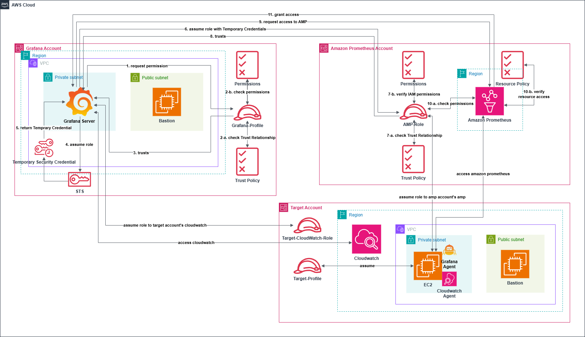

# Private Multi-Account Grafana AMP Monitoring

프라이빗 네트워크 및 멀티 어카운트 AWS 환경에서 **Grafana**, **Amazon Managed Prometheus (AMP)**, **CloudWatch** 및 **Grafana Agent**를 활용한 모니터링 시스템 구축입니다.

- 네트워크
  - Private Subnet에서 VPC Endpoints 이용한 통신
  - Grafana -> Target(Cloudwatch) : sts, monitoring, logs
  - Grafana -> AMP : sts, abs, abs-workspace
  - Target -> AMP : sts, abs, abs-workspace

- Assume Role

## 목차
- [Single EC2 Test](#Single-EC2-Test)
- [라이선스](#라이선스)

---

## Single EC2 Test

Public Single EC2 테스트를 통해 아래 구성 요소의 작동을 검증했습니다:

- **Prometheus**  
  Prometheus는 메트릭 수집 및 저장을 담당하며, EC2 인스턴스의 다양한 메트릭 데이터를 받아 저장합니다.

- **Grafana**  
  Grafana는 Prometheus에서 수집한 메트릭 데이터를 시각화하고, 사용자 정의 대시보드를 통해 시스템 모니터링 환경을 제공합니다.

- **Grafana Agent**  
  EC2 메타데이터 및 Node Exporter의 데이터를 수집하여 Prometheus로 전달하는 경량화된 에이전트입니다.

- **Node Exporter**  
  리눅스 기반 EC2 인스턴스에서 CPU, 메모리, 디스크 사용량 등의 하드웨어 및 시스템 수준 메트릭을 수집합니다.

자세한 구성 및 설정은 [Single EC2 Test Docs](single-ec2-test/single-ec2-test.md)를 참조하세요.

---

## 라이선스
이 프로젝트는 MIT 라이선스 하에 배포됩니다. 자세한 내용은 [LICENSE](LICENSE)를 참조하세요.
