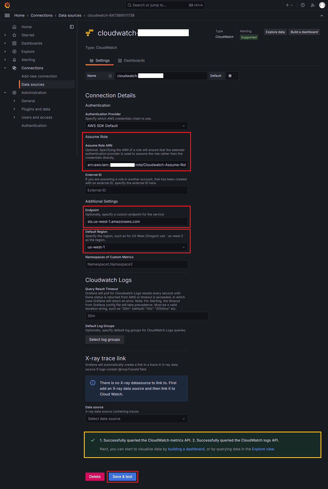
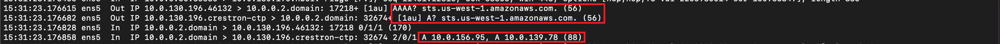

# Grafana Data Sources Configuration Guide

이 문서는 Private 네트워크 환경에서 Grafana의 CloudWatch 및 AMP 데이터 소스를 구성하는 방법을 설명합니다.

## 목차
- [1. CloudWatch Data Source 설정](#1-cloudwatch-data-source-설정)
- [2. AMP Data Source 설정](#2-amp-data-source-설정)
- [3. Private 환경 고려사항](#3-private-환경-고려사항)
- [4. 문제 해결](#4-문제-해결)

## 1. CloudWatch Data Source 설정

### 1.1 CloudWatch Data Source 추가
1. Grafana UI 접속
2. 좌측 메뉴(≡)에서 `Connections` 선택
3. `Data sources` 클릭
4. `Add new data source` 버튼 클릭
5. CloudWatch 검색 및 선택

### 1.2 Authentication 설정
1. Authentication Provider 선택: `AWS SDK Default`
2. Assume Role ARN 입력:
   ```
   arn:aws:iam::<TARGET_ACCOUNT_ID>:role/<CLOUDWATCH_ROLE_NAME>
   ```
3. Additional Settings - Default Region 설정: Grafana 서버가 위치한 리전 선택

### 1.3 Endpoint 설정 (Private 환경)
1. STS Endpoint URL 입력: Additional Settings - Endpoint
   ```
   https://sts.<REGION>.amazonaws.com
   ```
   - Private 환경에서는 VPC Endpoint 주소 사용 필수

   

### 1.4 기타 설정
1. Namespaces: 필요한 CloudWatch 네임스페이스 선택
2. Timeout: 기본값 사용 (60s)
3. Default Region: 모니터링 대상이 있는 리전 선택

## 2. AMP Data Source 설정

### 2.1 Prometheus Data Source 추가
1. `Add new data source` 클릭
2. Amazon Managed Service for Prometheus 검색 및 선택 (플러그인 설치 필요)

### 2.2 Connection 설정
1. Endpoint URL: AMP 워크스페이스의 쿼리 엔드포인트 입력
   ```
   https://aps-workspaces.<REGION>.amazonaws.com/workspaces/<WORKSPACE_ID>/
   ```
2. Custom HTTP Headers 추가 (필요한 경우)

### 2.3 Authentication 설정
0. `SigV4 auth` 활성화 (그라파나 서버 설정에서 활성화 필요)
1. Authentication Provider: `AWS SDK Default`
2. Assume Role ARN 입력:
   ```
   arn:aws:iam::<AMP_ACCOUNT_ID>:role/<AMP_ROLE_NAME>
   ```
3. Region 선택

### 2.4 Scrape Interval 설정
1. Scrape interval: 데이터 수집 주기 설정 (예: 15s)
2. Query timeout: 쿼리 타임아웃 설정 (예: 60s)

    

## 3. Private 환경 고려사항

### 3.1 VPC Endpoint 요구사항
1. CloudWatch 데이터 소스용:
   - com.amazonaws.<region>.monitoring
   - com.amazonaws.<region>.logs
   - com.amazonaws.<region>.sts

2. AMP 데이터 소스용:
   - com.amazonaws.<region>.aps-workspaces
   - com.amazonaws.<region>.aps
   - com.amazonaws.<region>.sts

### 3.2 네트워크 설정
1. Security Group 설정:
   - VPC Endpoint Security Group: 인바운드 443 포트 허용
   - Grafana 서버 Security Group: 아웃바운드로 VPC Endpoint 443 포트 허용

## 4. 문제 해결

### 4.1 연결 테스트
1. 각 데이터 소스 설정 완료 후 `Save & test` 클릭
2. 성공적인 연결 시 "Data source is working" 메시지 확인

### 4.2 일반적인 문제
1. 연결 실패:
   - IAM Role 권한 확인
   - VPC Endpoint 설정 확인
   - Security Group 규칙 확인

2. 타임아웃 발생:
   - VPC Endpoint 경로 설정 확인
   - DNS 확인 설정 점검

3. 인증 오류:
   - AssumeRole 권한 확인
   - Trust Relationship 설정 확인

### 4.3 로그 확인
1. Grafana 서버 로그 확인:
   ```
   sudo tail -f /var/log/grafana/grafana.log
   ```

2. CloudWatch 로그 확인:
   - CloudWatch Log Groups에서 관련 로그 확인

### 4.4 VPC 엔드포인트 요청 관련
- Default 는 <sts.amazonaws.com> 로 NAT 및 IGW 를 이용하지 않는 환경에서는 통신 불가
- `10.0.0.2` 는 AWS DNS 서버로 `sts.amazonaws.com` 의 주소를 질의하면 `209.54.177.164` 라는 Public 주소를 반환

  - Public
  
  - Private
  
  - DNS 확인
  